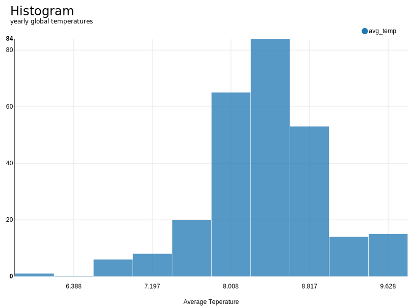
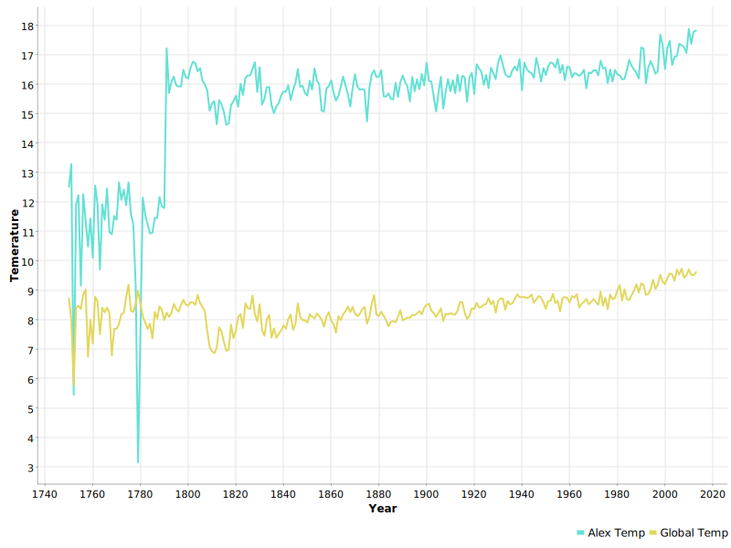

# 🌍 Global Temperature Analysis with KNIME

By: Mohamed Almatbaagy

This project solves a real-world data analytics case using the KNIME platform, focusing on temperature trends across countries over the past 270 years.

---

## 📌 Objectives

The task involved using two datasets (city and global temperature data) to:

1. Compute country-wise temperature averages
2. Classify countries by temperature range
3. Compare country averages to global temperature trends
4. Identify outliers
5. Visualize distributions and city-global comparisons

---

## 🛠️ Tools Used

- **KNIME Analytics Platform**
- **Data Sources**: Provided city and global temperature CSVs
- **Nodes Used**: GroupBy, Row Filter, Joiner, Math Formula, Numeric/Auto Binner, Histogram, Line Plot

---

## 📷 Sample Visuals

### Histogram: Global Yearly Temps

### Line Chart: Alexandria vs Global Temp

